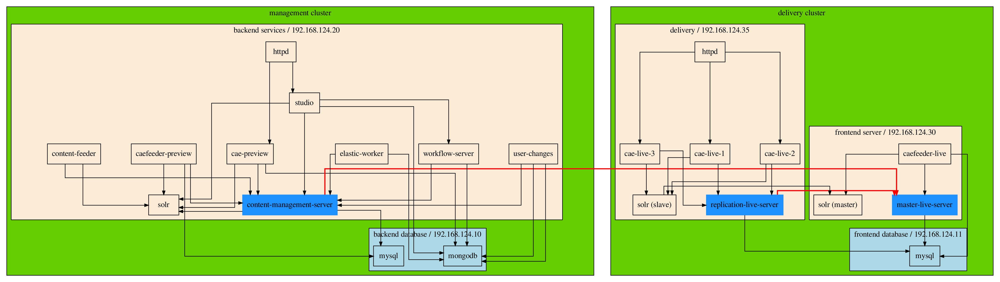

# Infrastructure for an CoreMedia Setup

This is an Multi-Nodes Deployment.

The infrastructure is provided by Terraform.

The required software is rolled out via ansible.

This split the CoreMedia *Standard* (OneNode4All) deployment into a real production Multi-Nodes setup.

The services are rolled out to various virtual servers:

| Node         | Services |
| :------      | :---------- |
| **database** | mysql, mongodb |
| **backend**  | content-management-server, content-feeder, user-changes, elastic-worker, cae-preview,<br> studio, caefeeder-preview, workflow-server, solr |
| **frontend** | master-live-server, caefeeder-live, solr |
| **delivery** | replication-live-server, cae-live-1, cae-live-2, cae-live-3 |



# prepare your system **before** you start

add some `hosts` entries for DNS resolutions

```
192.168.124.10          database.cm.local
192.168.124.20          backend.cm.local
192.168.124.30          frontend.cm.local
192.168.124.35          delivery.cm.local
192.168.124.50          monitoring.cm.local
```


# create the infrastructure

Take a look into `terraform`

# deploy the CoreMedia stack

Take a look into `ansible`

# take a look in the monitoring

Take a look into `monitoring`


# SSL zertificate

```
cat > csr_details.txt <<-EOF
[req]
default_bits = 4096
prompt = no
default_md = sha512
req_extensions = req_ext
distinguished_name = dn

[ dn ]
C=DE
ST=Hamburg
L=Hamburg
O=Acme, Inc
OU=Testing Domain
emailAddress=cert@cm.local
CN = *.cm.local

[ req_ext ]
subjectAltName = @alt_names

[ alt_names ]
DNS.1 = cm.local
DNS.2 = database.cm.local
DNS.3 = backend.cm.local
DNS.4 = frontend.cm.local
DNS.5 = delivery.cm.local
DNS.6 = monitoring.cm.local
DNS.7 = mysql.cm.local
DNS.8 = mongo.cm.local
DNS.9  = *.delivery.cm.local
DNS.10 = *.backend.cm.local
DNS.11 = overview.cm.local
DNS.12 = corporate.cm.local
DNS.13 = studio.cm.local
DNS.14 = preview.cm.local
DNS.15 = *.be.cm.local
DNS.16 = *.fe.cm.local
IP.1=192.168.124.10
IP.2=192.168.124.20
IP.3=192.168.124.30
IP.4=192.168.124.35
IP.5=192.168.124.50
EOF

# Let’s call openssl now by piping the newly created file in
openssl req -new -sha512 -nodes -out cm.local.csr -newkey rsa:4096 -keyout cm.local.key -config <( cat csr_details.txt )
openssl dhparam -out dh.pem 2048

#
openssl req -noout -verify -in cm.local.csr
openssl req -text -noout -in cm.local.csr

#
openssl x509 -in cm.local.csr -out cm.local.pem -req -signkey cm.local.key -days 365

cat cm.local.key >> cm.local.pem


```
