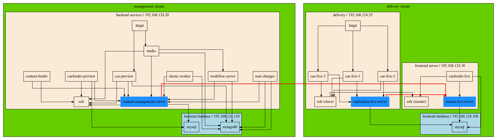

# Infrastructure for an CoreMedia Setup

**The repository is not offered by [CoreMedia](https://www.coremedia.com/de/) or my employer ([Tallence AG](https://www.tallence.com))!**

**The information or code found here is created by me in my spare time!**

---

This repository is intended to serve as a demonstrator for the automated provision of a CoreMedia system.

Starting with the development of the infrastructure via Terraform, to the roll-out of the CoreMedia software via Ansible and the implementation of a monitoring system.

The demonstrator and the infrastructure used here is based on my past experience with CoreMedia systems (among others for stern.de) and my personal recommendation.

It will therefore differ from development systems and possibly also from an already existing infrastructure.

If you have any questions, please do not hesitate to contact me if you have a suitable timeframe.

For further information or problem analyses, both CoreMedia and my employer - or other specialized companies - are at your disposal.

---

**I reserve the right to block or delete this repository at any time.**

---

## setup

My recommendation for a staging CoreMedia setup is as follows

| Virtual Machine         | Resources                    | Services    |
| :------                 | :-----------                 | :---------- |
| **database backend**    | 1 vCPU, 1 GiB RAM, 8 GiB HDD | mysql, mongodb, solr |
| **database frontend**   | 1 vCPU, 2 GiB RAM, 8 GiB HDD | mysql |
| **backend**             | 2 vCPU, 4 GiB RAM, 8 GiB HDD | content-management-server, content-feeder, user-changes, elastic-worker, cae-preview,  studio, caefeeder-preview, workflow-server |
| **frontend**            | 2 vCPU, 4 GiB RAM, 8 GiB HDD | master-live-server, caefeeder-live, solr-master |
| **delivery**            | 1 vCPU, 2 GiB RAM, 8 GiB HDD | replication-live-server, cae-live-1, cae-live-2, cae-live-3, solr-slave |

## security

For security reasons, the connections between the different environments and the VMs have been reduced to a minimum.

In addition, communication between the VMs on the VMs is restricted using iptables.

My recommendation is also to equip all VMs with an additional network card. This should be used for communication between the CoreMedia Services.

## scalability

The only application that can sensibly handle more traffic is an additional CAE.

However, for performance reasons, an RLS can only serve a limited number of CAEs.

In the case of excessive and high-frequency traffic, an additional VM with an RLS and additional CAEs can be included in the setup.

With high-frequency websites, you should consider whether including an external CDN in the architecture could be a worthwhile investment.

## repositories

I separated the repositories a bit and put them together in a GitLab group.

### infrastructure

https://gitlab.com/coremedia-as-code/infrastructure

### deployment

https://gitlab.com/coremedia-as-code/deployment

### monitoring

https://gitlab.com/coremedia-as-code/monitoring

